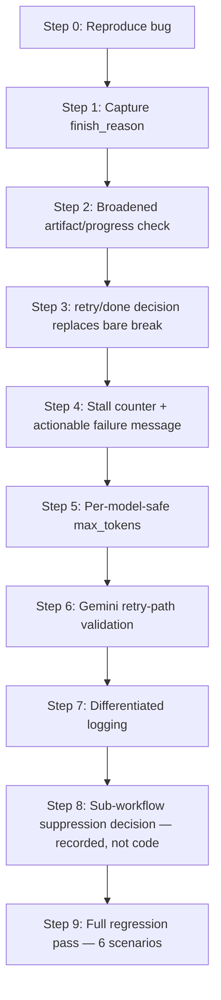

# Agent Runner Completion-Detection Fix Plan

## Problem

The agent loop in `web/agent_runner.py` treats "no tool_calls in this turn" as
the sole signal that the pipeline is complete (see the `if not tool_calls_list:
break` block). This does not distinguish:

- The model genuinely finishing the task (`finish_reason == "stop"` with real
  pipeline progress made), from
- The model being truncated by the `max_tokens` cap mid-thought
  (`finish_reason == "length"`), from
- The model stopping early without having done any required work (confused,
  under-specified request, etc.)

All three cases are currently reported as `job_done`, which can silently
produce an empty or broken presentation while the UI claims success.

## Step 0 — Baseline repro (no code change)

Temporarily lower `max_tokens` to `500` on a real job to reproduce the
false-`done` bug. This is the regression target for the final regression pass.

## Step 1 — Capture `finish_reason` in both call paths

- Streaming path (`web/agent_runner.py:276-322`): track `choice.finish_reason`
  across chunks (currently only checked once, at line 319, to end the read
  loop on `"stop"`).
- Non-streaming path (`web/agent_runner.py:233-274`, used for Gemini models):
  read `choice.finish_reason` directly from the response object.
- Initialize `finish_reason = None` before the `try` block so it is always
  defined.

**Test:** confirm `"stop"` on normal completions, `"length"` when truncated,
for both a streaming (Claude) and non-streaming (Gemini) model.

## Step 2 — Broadened artifact/progress check

Factor out a helper `_has_pipeline_progress(project_path) -> bool` that
returns `True` if **any** of the following exist, not just SVGs:

- `svg_output/*.svg` (main pipeline mid/post-generation)
- `design_spec.md` **and** `spec_lock.md` (covers the `refine-spec` workflow
  legitimately pausing before SVG generation, and the normal pipeline's
  Strategist phase)
- any file under the project directory that postdates job start (generic
  fallback for workflows not explicitly enumerated, e.g.
  `native-enhance-pptx`, `beautify-pptx`)

This must be a **separate** helper from the existing `exports/*.pptx` check
used later at `web/agent_runner.py:380-390` — that check is specifically for
whether a PPTX has been exported (deliberately deferred to download time per
`web/skill_prompt.py:26-27`, "Do NOT run svg_to_pptx.py"), and must not be
reused here or every normal successful run would be misclassified as
incomplete.

**Test:** run the `refine-spec` workflow explicitly (see `AGENTS.md` opt-in
trigger) and confirm it is classified as `"done"`, not `"retry"`, once
`design_spec.md`/`spec_lock.md` exist but no SVGs do.

## Step 3 — Replace the bare "no tool_calls ⇒ done" check

Replace `web/agent_runner.py:347-350` with a decision using `finish_reason`
(Step 1) + `_has_pipeline_progress` (Step 2):

- `tool_calls_list` non-empty → unchanged, execute tools.
- Empty + `finish_reason == "length"` → `"retry"` (truncated).
- Empty + `finish_reason == "stop"` + no progress at all (not even a spec) →
  `"retry"` (stopped without doing anything — likely stall/confusion).
- Empty + `finish_reason == "stop"` + any recognized progress marker →
  `"done"`.
- Any other/unexpected `finish_reason` (`content_filter`, `null`, etc.) →
  `"retry"` on first occurrence, subject to the stall counter.

On `"retry"`: append a nudge message differentiated by cause (truncation vs.
no-progress) and `continue` the `while` loop instead of `break`.

Example nudge messages:

```python
if finish_reason == "length":
    nudge = (
        "Your previous response was cut off by the token limit before you "
        "finished. Continue exactly where you left off — if you were about "
        "to call a tool, call it now."
    )
else:
    nudge = (
        "You stopped without making progress on the pipeline (no project, "
        "spec, or slides were produced). Please continue the pipeline from "
        "SKILL.md, or if the request is ambiguous or missing required "
        "information, clearly state what is needed."
    )
```

**Test:** re-run the Step 0 repro; confirm self-heal via retry instead of a
false `done`.

## Step 4 — Stall counter with a bounded, actionable failure message

- `stall_count = 0` before the loop; increment on every `"retry"`; reset to
  `0` whenever a tool call is actually executed (inside the existing
  `for tc in tool_calls_list:` block, `web/agent_runner.py:353`).
- Threshold: 3 consecutive retries → `store.set_status(job_id, "error")`,
  `store.set_error(...)`, `return`.
- When failing on a _no-progress_ pattern specifically (as opposed to
  truncation), make the error message actionable, e.g.:
  `"Agent stopped repeatedly without producing output — this often means "
"the request was ambiguous or missing required source material. Try "
"rephrasing the topic or attaching source files."`
  This does not add a new "ask the user mid-pipeline" tool (that is a larger,
  separate scope change) — it just converts an opaque failure into an
  actionable one.

**Test:** mock/force a model that always returns empty `"stop"` responses
with no artifacts; confirm clean failure with the actionable message after 3
attempts, not a spin to `max_iterations = 200`.

## Step 5 — Per-model-safe `max_tokens`

- Replace the two hardcoded `max_tokens=16000` values
  (`web/agent_runner.py:245`, `web/agent_runner.py:285`) with a helper
  `_max_tokens_for(model: str) -> int`. All models currently offered in the
  UI's dropdown (`claude-sonnet-5`, `claude-sonnet-4.6`,
  `gemini-3.1-pro-preview`, `gpt-5.4`) support 32K+ output tokens, so the
  helper returns a flat `32000` unconditionally, regardless of model name.
- On an HTTP 400 from the API that indicates a token/`max_tokens` limit
  problem, catch it in the existing `except Exception` block
  (`web/agent_runner.py:324-338`) and retry once at the conservative
  `16000` before failing outright. This fallback is retained purely as a
  safety net for the edge case of an env-overridden `AGENT_MODEL` pointing at
  some other model outside the UI's known set with a lower real ceiling — it
  avoids turning "sometimes truncates" into "hard-fails immediately" in that
  case.

**Test:** run against each model configured on the LiteLLM proxy at least
once; confirm no new 400s introduced by the flat 32000 default.

## Step 6 — Gemini-specific retry-path validation

Dedicated test: force a truncation/no-progress retry scenario specifically on
a Gemini model, verifying that:

- injecting the synthetic nudge message does not break `thought_signature`
  round-tripping (`web/agent_runner.py:65-79`, `265-273`),
- the non-streaming path does not 400 on the next call due to a broken
  tool_call/tool_result adjacency expectation.

If this surfaces incompatibilities, the nudge-injection logic may need a
Gemini-specific branch (e.g. appending the nudge as a `system`-role reminder
instead of `user`, or only after confirming the prior turn's
tool_call/tool_result pairing is intact).

## Step 7 — Distinct logging per outcome

Replace the single `"\n[Agent] Pipeline complete.\n"` log line with
differentiated `[Agent]`-prefixed log lines for: truncation-retry,
no-progress-retry, stall-failure (using the actionable message from Step 4),
and genuine completion. Reuses the existing `[Agent]`/`[Tool]` log styling in
`web/static/index.html:2365-2367` — no frontend changes needed.

## Step 8 — Sub-workflow suppression decision (recorded, not code)

Decision: **(a)** Leave opt-in sub-workflows (`refine-spec`,
`resume-execute`, etc.) reachable in web mode, relying on Step 2's broadened
artifact check to correctly classify their intentional pauses as `"done"`.
This is acceptable because the web UI has no session-resume UX, so a `"done"`
job that only produced a spec is at least an honest, inspectable stopping
point. Rejected alternative: adding an explicit instruction to
`web/skill_prompt.py` telling the model to skip such workflows — deferred
because it requires prompt tuning and Step 2 already makes the current
behavior safe.

## Step 9 — Regression pass

Run to completion:

1. Normal small job — confirm unchanged behavior/timing vs. pre-fix baseline.
2. Step 0 tiny-`max_tokens` repro — confirm self-heal in one extra iteration.
3. Forced permanent-stall scenario — confirm clean, actionable failure within
   the stall bound.
4. `refine-spec` workflow explicitly invoked — confirm correctly classified
   as `"done"`, not retried into failure.
5. Gemini model truncation/no-progress scenario — confirm no
   `thought_signature`/400 regressions.
6. Each model configured on the LiteLLM proxy — confirm no new 400s from the
   `max_tokens` change.

## Known deferred gap

There is no tool for the model to ask an open-ended clarifying question
mid-pipeline (the only user-interaction primitive is `confirm_gate`, fixed to
the Eight Confirmations step — see `web/tools.py:224-240`). This fix does not
add one; it is flagged here as a candidate follow-up task, since it is a
larger scope change (new tool + UI support) than fixing completion detection.

## Sequencing diagram


